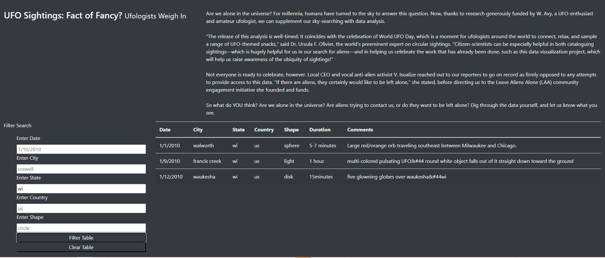
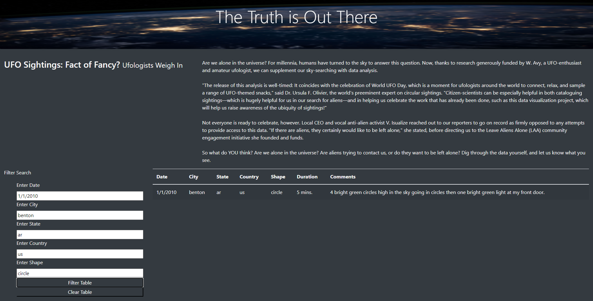

# UFO
### Overview
The purpose of this project was to create a website for tracking UFO sightings in the United States. We created a table that can be filtered for multiple search criteria at the same time.
### Results
The new webpage is quite simple and intuitive. I think that most users will have no problem figuring it out on their own. On the left hand side of the webpage there are 5 boxes for users to enter information to filter the UFO sightings. Users can enter information into 1 box if they prefer or they can enter information into all 5 boxes to make the search as specific as possible. If users wanted info on all UFO sightings in Wisconsin they would type “wi” into the state box and click filter table.

If a user wanted to see results for Benton, Arizona on 1/1/2010 in the shape of a circle they could enter the date, city, state, country, and shape and get that 1 specific result. 

### Summary
One drawback of the sight is the limited amount of data it has. I think there should be a larger pool of UFO sightings to look through. I think one way the sight could be improved would be to be able to search for key words and phrases from the description. I also think including pictures for the sightings that have them available would be useful.
